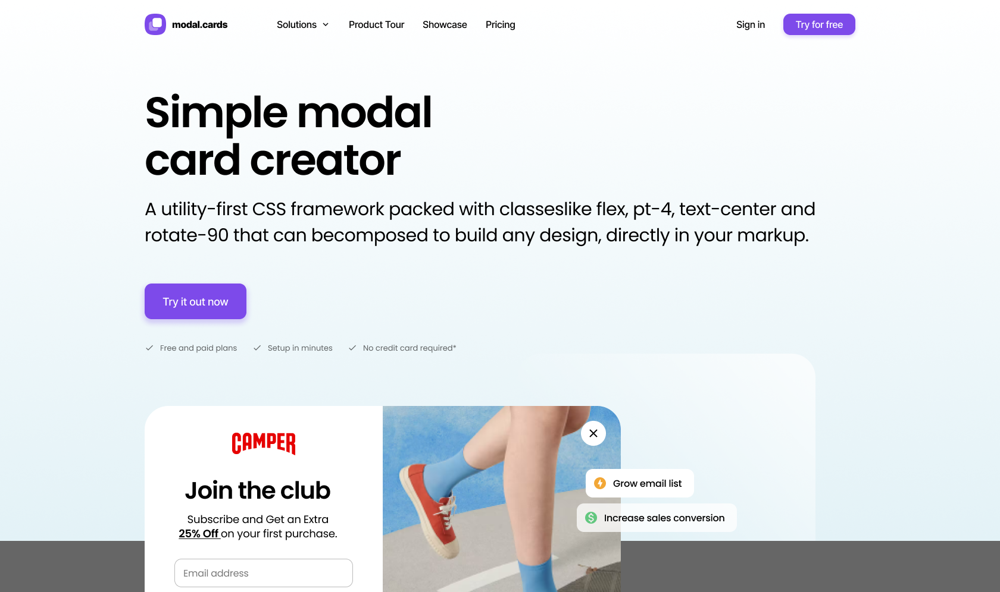
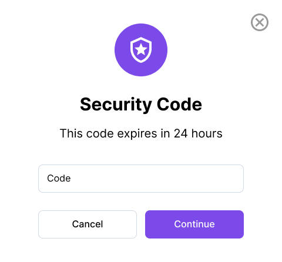
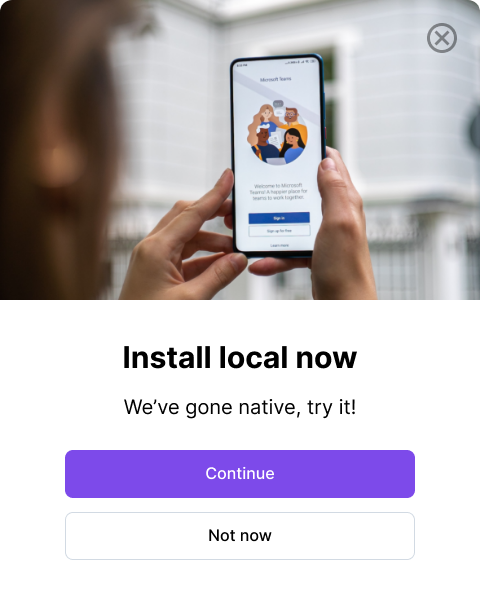
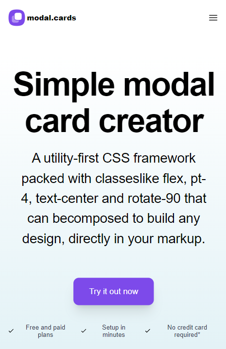

# Popupsmart Modal Creator

> https://popupcreator.netlify.app/

---

---

- Modal Samples

  
  
  

---

- [tailwindcss](https://tailwindcss.com/) with [sass](https://sass-lang.com/)

- Responsive design

  

## License

[MIT](https://choosealicense.com/licenses/mit/)
